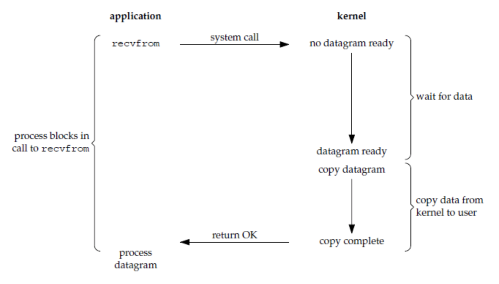
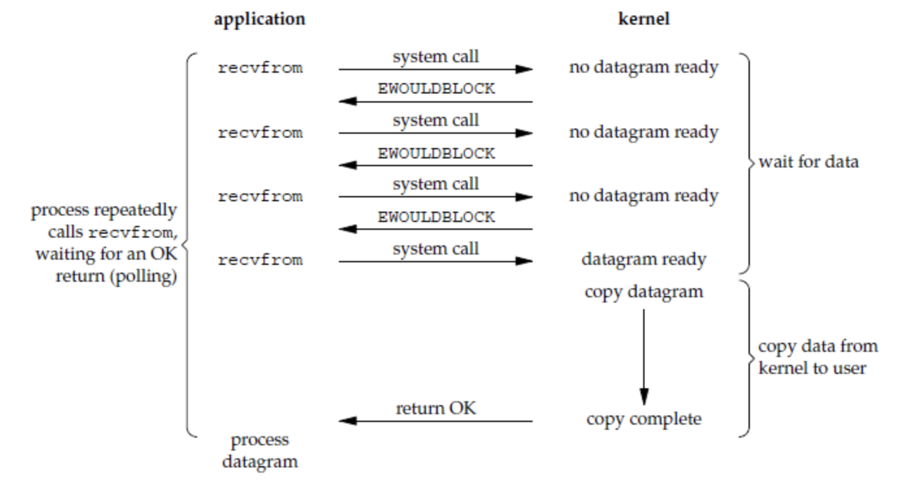
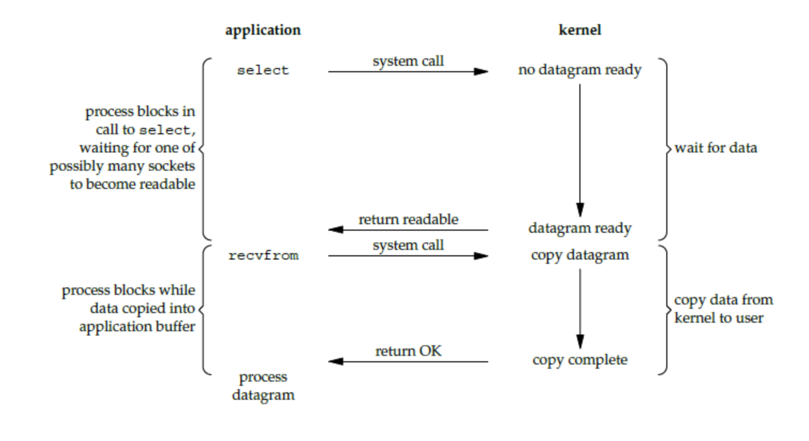
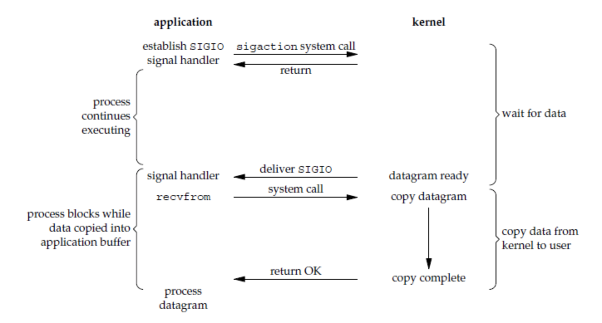
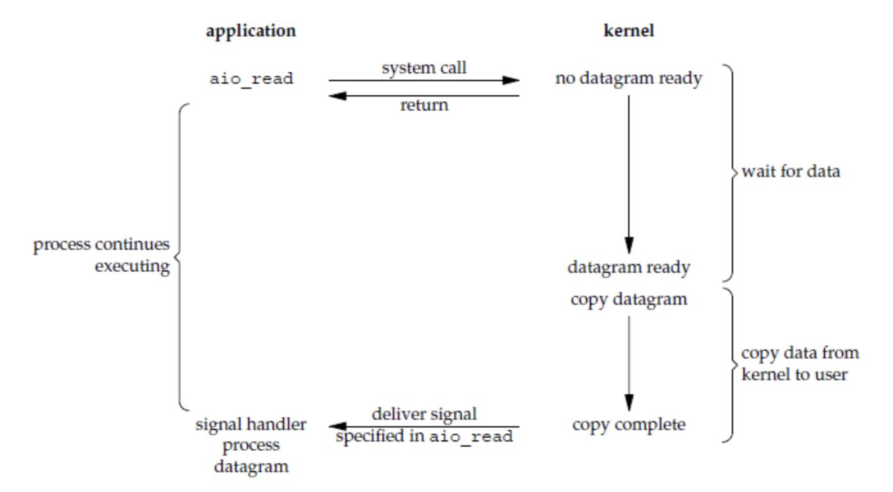
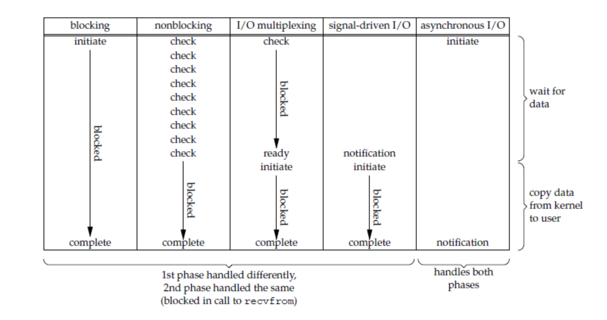

#**IO模型**
输入操作包含两个阶段：  
1. 数据准备阶段（数据存储到内核空间的缓冲区）
2. 将数据从内核空间复制到用户空间 

Unix有5种IO模型：  
1. 阻塞式IO
2. 非阻塞式IO
3. IO复用
4. 信号异步IO
5. 异步IO
recvfrom()用于接收 Socket 传来的数据，并复制到应用进程的缓冲区 buf 中。这里把recvfrom()当成系统调用。  
`ssize_t recvfrom(int sockfd, void *buf, size_t len, int flags, struct sockaddr *src_addr, socklen_t *addrlen);`

阻塞式IO  
1. 执行系统调用后，该应用被阻塞，直到数据完成 从内核空间复制到用户空间 才会返回  
2. 该应用被阻塞，其他应用可以继续使用CPU，因此该模式下，CPU的利用率较高  
  

非阻塞式IO  
1. 执行系统调用后，内核返回一个错误码，但是该应用可以继续执行，但是需要不断的执行系统调用轮询，获知IO是否完成，因此该应用不阻塞  
2. 该模式下，CPU需要处理更多的系统调用，因此CPU利用率较低。  
  

IO复用（事件驱动IO）   
1. 使用select或者poll等待数据，此时应用被阻塞。当多个socket中的一个可读时，此时返回。  
2. 该模式可以让单个进程处理多个IO事件。相比于多进程和多线程技术，IO复用不需要进程线程创建和切换的开销，系统开销更小。  
  

信号驱动IO  
1. 应用进程使用 sigaction 系统调用，内核立即返回，应用进程可以继续执行,该应用是非阻塞的。  
2. 内核在数据到达时向应用进程发送 SIGIO 信号，应用进程收到之后在信号处理程序中调用`recvfrom()`将数据从内核复制到应用进程中。  
3. 相比于非阻塞式 I/O 的轮询方式，信号驱动 I/O 的 CPU 利用率更高  
  

异步IO  
1. 应用进程执行 aio_read 系统调用会立即返回，应用进程可以继续执行，不会被阻塞，内核会在所有操作完成之后向应用进程发送信号。  
2. 异步 I/O 与信号驱动 I/O 的区别在于:    
异步 I/O 的信号是通知应用进程 I/O 完成   
信号驱动 I/O 的信号是通知应用进程可以开始 I/O  
  

IO模型比较：  
1. 同步IO：将数据从内核缓冲区复制到应用进程缓冲区（第二阶段），应用进程会被阻塞。  
2. 异步IO：第二阶段不会被阻塞。
  

